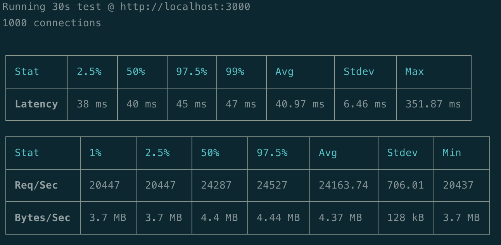
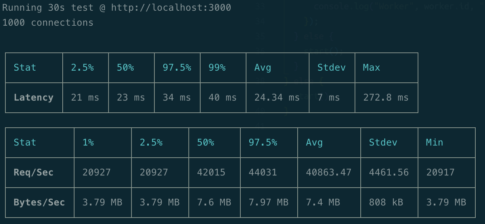

# node-cluster-example

Testing NodeJS performance with [autocannon](https://github.com/mcollina/autocannon) and a [Koa](https://github.com/koajs/koa) server.

### Tests

#### Single core performance

Running `yarn start:single` and a test with `yarn test:single` seems to handle an average amount of ~**24100** connections on my local machine (2019 16" MBP, 2.4 GHz 8-Core Intel Core i9).

#### Multi core performance

Running `yarn start:cluster` and a test with `yarn test:cluster` seems to handle an average amount of ~**41000** connections on my local machine (2019 16" MBP, 2.4 GHz 8-Core Intel Core i9).

